# project-hw1
# 進位轉換器

這是一個具有圖形化介面 (GUI) 的進位轉換程式，支援二進位、十進位與十六進位之間的雙向互相轉換。
程式完全由數學邏輯運算實作，**不使用任何內建的進位轉換函式 (如 `int(x, 2)` 或 `hex()`)**，且支援大於 255 的數值轉換。

## 核心轉換邏輯

本程式包含四個自訂的轉換函式：
* `dec_to_bin(n)`: 利用「除以 2 取餘數」的方式，將餘數收集於串列中，最後反轉並連接字串。
* `dec_to_hex(n)`: 利用「除以 16 取餘數」，並透過自建對照表 `"0123456789ABCDEF"` 轉換出 A-F，支援無限大數字。
* `bin_to_dec(bin_str)`: 透過迴圈由右至左讀取字串，乘上對應的 2 的次方數並加總。
* `hex_to_dec(hex_str)`: 將輸入字串轉為大寫，由右至左利用 `.index()` 查表找出對應數值，乘上 16 的次方數。

## 防呆與例外處理 (Exception Handling)

為了確保程式的穩定性與使用者體驗，加入了以下防護機制：
1. **輸入格式檢查**：在呼叫轉換函式前，嚴格檢查輸入的字串是否符合該進位制（例如：二進位只能輸入 0 與 1）。若輸入錯誤，會彈出警告視窗 (MessageBox) 阻擋。
2. **前面開頭有零 (Leading Zeros) 檢查**：若使用者輸入如 `0010` 這種開頭帶有多餘零的無效格式，程式會會彈出警告視窗 (MessageBox) 要求重新輸入。
3. **Try-Except**：最外層使用 `try...except` 區塊，防止未知錯誤導致程式錯誤。

## 程式執行截圖

以下為程式實際運作的畫面：

### 1. 正常轉換成功畫面
將 12345 轉換為二進位的畫面。
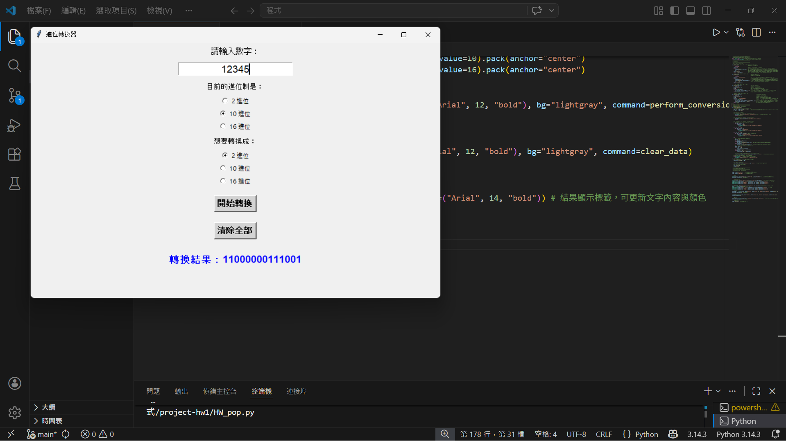

將 54321 轉換為十六進位的畫面。
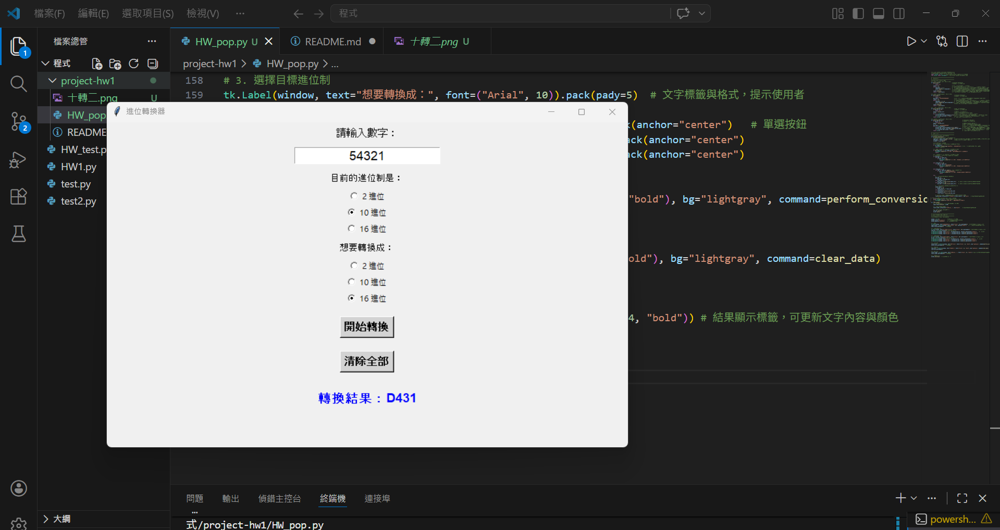

將 1111100000 轉換為十進位的畫面。

將 1111100000 轉換為十六進位的畫面。
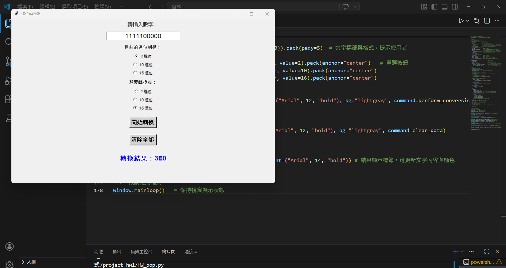

將 A2C 轉換為十進位的畫面。
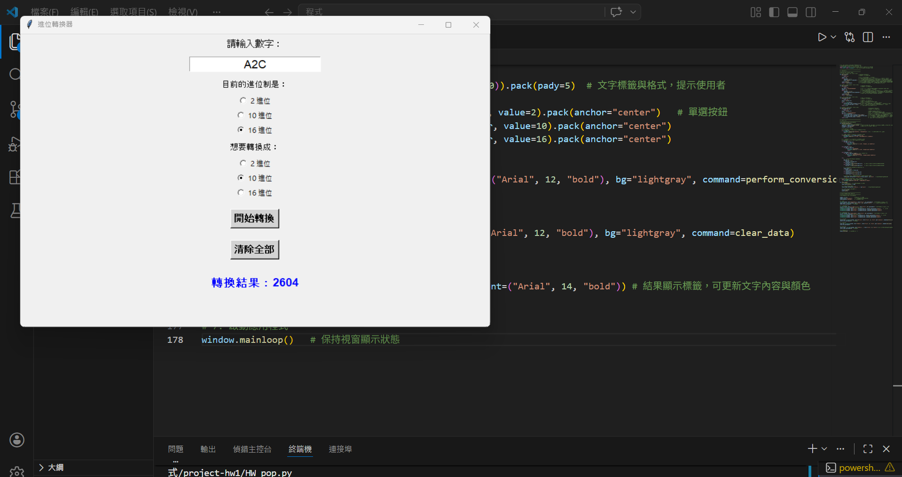

將 A2C 轉換為二進位的畫面。
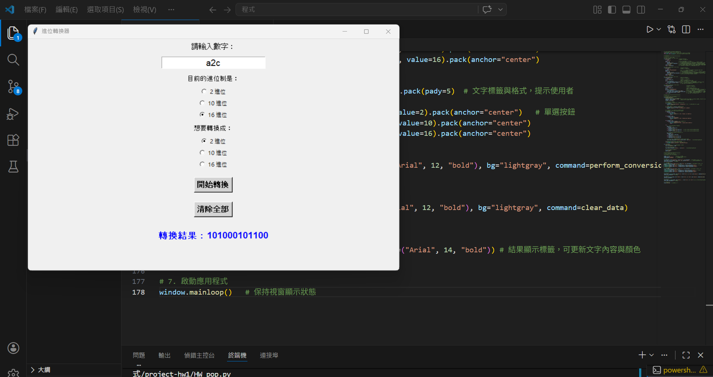

### 2. 輸入錯誤格式的警告視窗
未輸入任何東西按下開始轉換
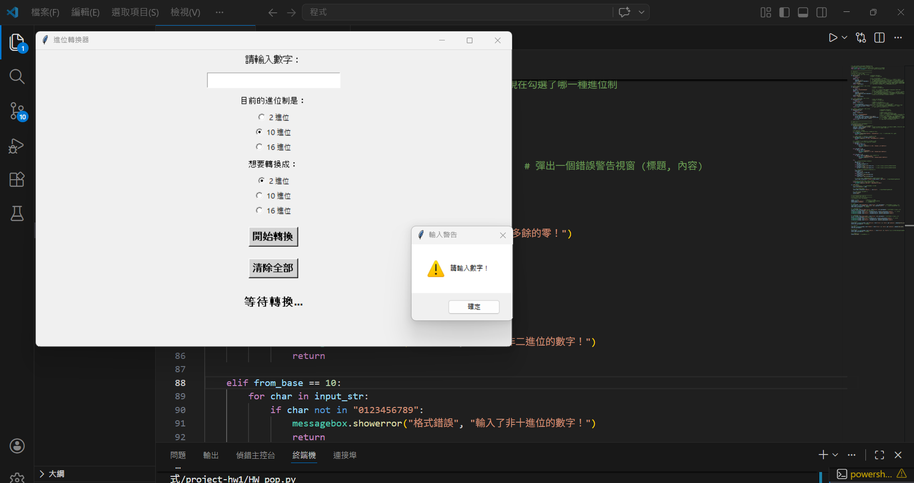

輸入 0010
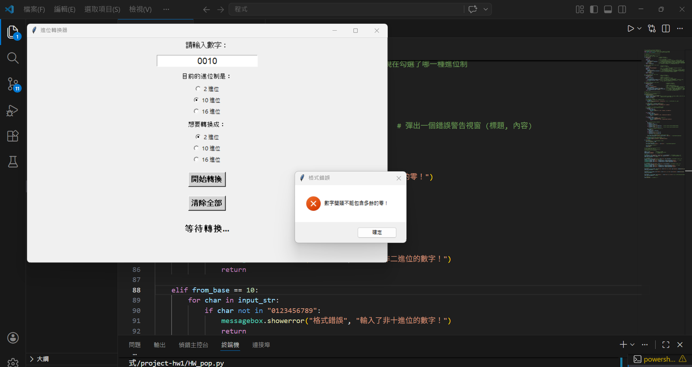

二進位輸入 123
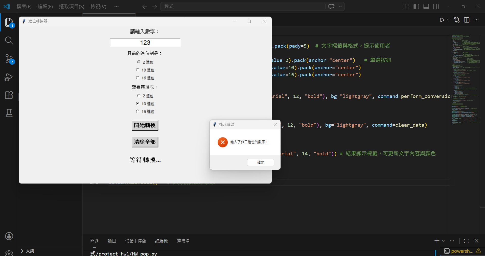

十進位輸入 ABC
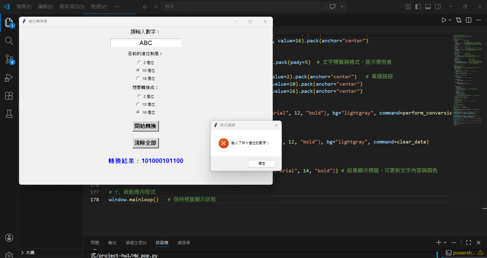

十六進位輸入 XYZ
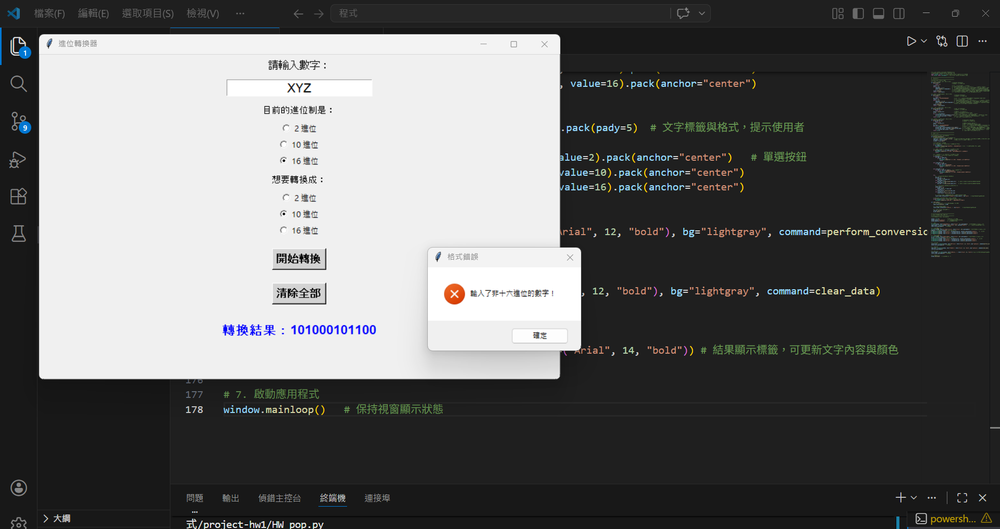

### 3. 清除功能測試
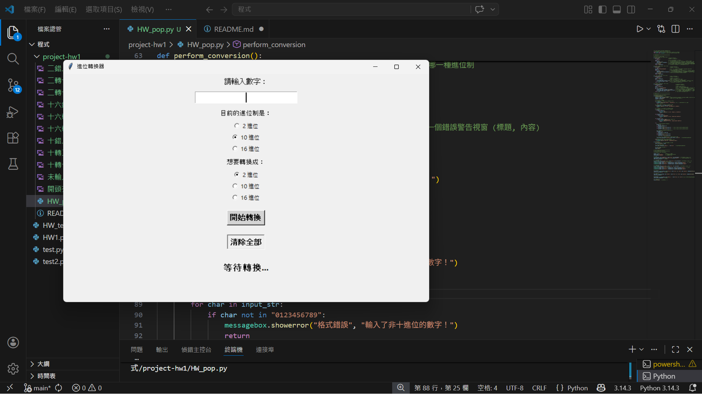